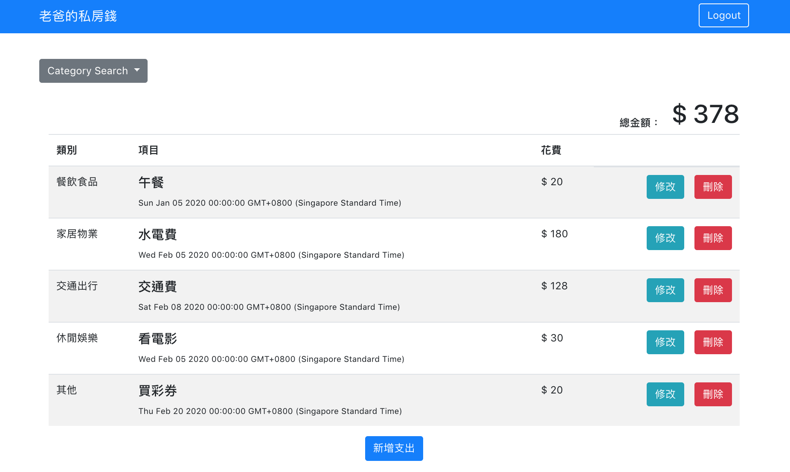

# expense-tracker Web Application 1.0
This application is to let user search and view the restaurant details (Rating, descriptions etc)

# Main page



## 使用者故事
```
1）在首頁一次瀏覽所有支出的清單
2）在首頁看到所有支出清單的總金額
3) 新增一筆支出
4) 編輯支出的所有屬性 
5) 刪除任何一筆支出 
6) 在首頁可以根據支出「類別」篩選支出；總金額的計算只會包括被篩選出來的支出總和
7) 透過 email 跟秘密註冊與登入，並只能看到自己建立的支出（使用者必需登入才可以使用這個 app 或看到資料）
8) 在註冊時輸入使用者名稱、email 與 password，所有都是必填欄位
9) 透過 Facebook 帳號登入
```

## Getting Started
1. open terminal - git clone from branch --> user-login-register/flash-message
```
git clone https://github.com/crazy-hour-ai/restaurant_list.git
```
2. Initialize project
```
npm install
```
3. Start project on development mode
```
npm run dev
```
4. Start the project on browser by 
```
http://localhost:3000 
```

## Settings
Create .env file under root directory for using Facebook API,
```
FACEBOOK_ID=xxxxxxxx
FACEBOOK_SECRET=xxxxxxxx
FACEBOOK_CALLBACK=http://localhost:3000/auth/facebook/callback
```

## 種子資料

+ 使用者可以建立 user dummy data
```
npm run seeder
```
  - user1
  ```
    email: user1<span>@example.com</span>  
    password: 12345678  
  ```
  - user2   
  ```
    email: user2<span>@example.com</span>  
    password: 12345678  
  ```
